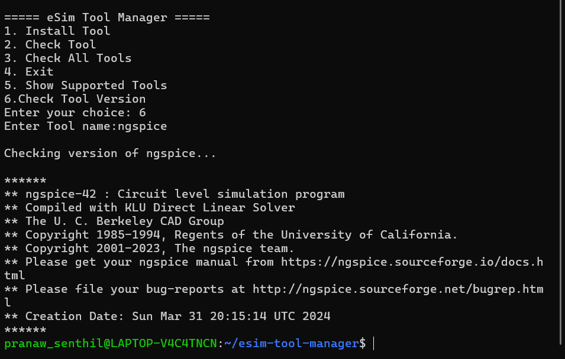

# 🚀 eSim Tool Manager (CLI)

A Python-based CLI tool to **check, install, and manage circuit simulation tools** like ngspice and KiCad.

---

## 📖 Overview

eSim Tool Manager is a simple command-line utility that helps users quickly verify and install required tools for circuit simulation environments.

It is especially useful for:
- Students using **eSim / ngspice / KiCad**
- Linux users setting up simulation environments
- Beginners who want automation instead of manual setup

---

## ✨ Features

- ✔ Check if a tool is installed  
- ⚙️ Install tools automatically  
- 🔍 Check all tools at once  
- 📋 Show supported tools  
- 📌 Check tool versions  
- ❌ Handle unsupported tools gracefully  

---

## 🛠️ Supported Tools

- ngspice  
- kicad  
- python3  
- htop  

---

## 📸 Demo

